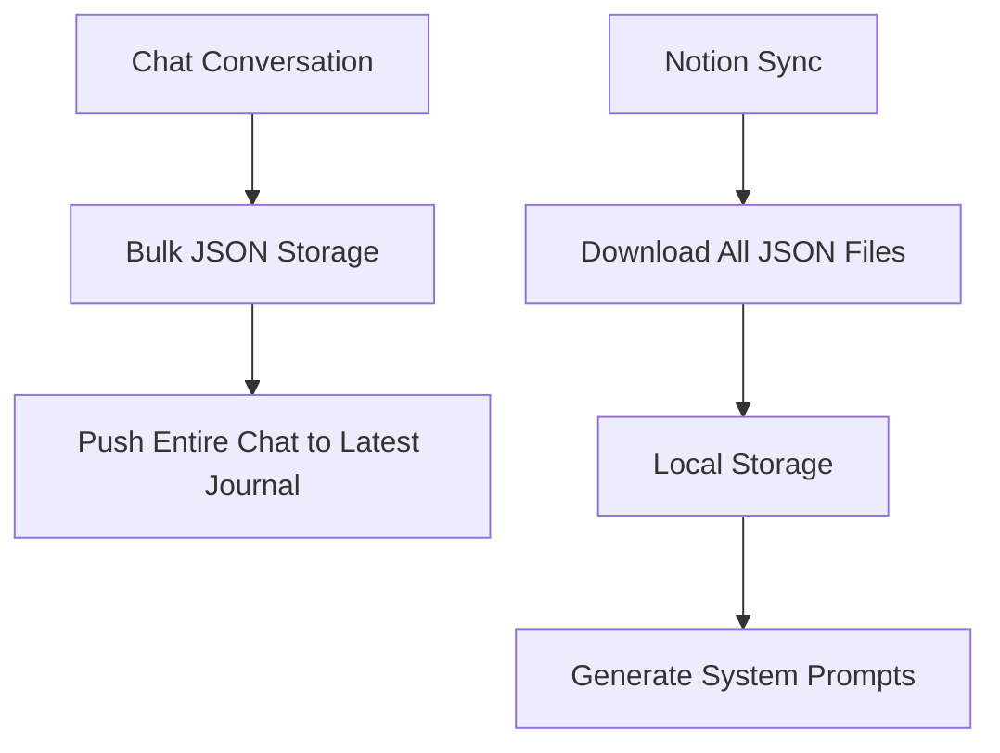
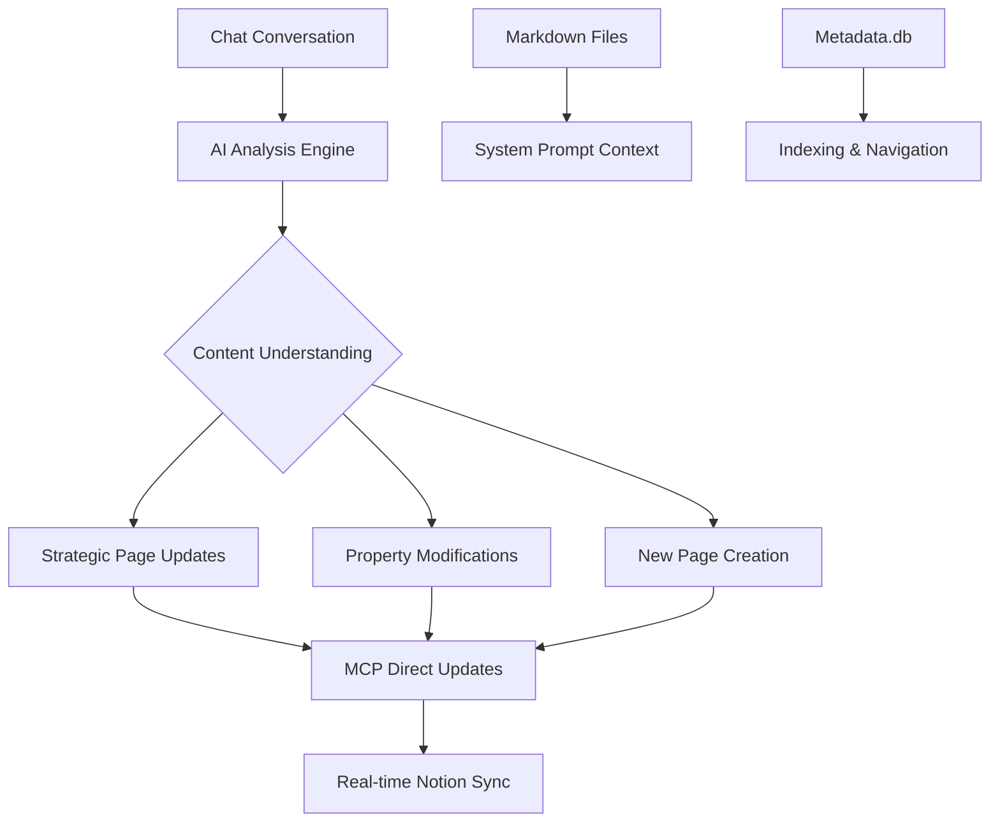

# Intelligent Architecture: From JSON Storage to MCP-Driven AI Operations

## Executive Summary

This document outlines the architectural evolution of Promaia from a bulk data storage system to an intelligent AI-driven platform that leverages Model Context Protocol (MCP) for real-time Notion integration. The new architecture eliminates redundant JSON storage (944KB) while providing more sophisticated content relationship understanding and strategic updates.

## Current Architecture (Legacy)

### Data Storage Components
```
data/
├── json/              # 944KB - Complete Notion content (REDUNDANT)
├── md/               # 168KB - Human-readable exports (KEEP)
└── metadata.db       # 72KB - Registry/indexing (KEEP)
```

### Problems with Current System
1. **Data Redundancy**: JSON files duplicate information already accessible via Notion API
2. **Stale Data**: Local JSON becomes outdated between sync operations
3. **Bulk Operations**: Dumb push operations without content understanding
4. **Storage Waste**: 944KB of JSON data that's rarely read, only written
5. **Poor Relationships**: No understanding of content connections across databases

### Current Workflow


## Proposed Architecture (Intelligent)

### Core Components
```
data/
├── md/               # 168KB - Human-readable exports with properties (ENHANCED)
└── metadata.db       # 72KB - Registry/indexing (ENHANCED)

AI Intelligence Layer:
├── MCP Integration   # Real-time Notion access
├── Chain-of-Thought  # Strategic decision making
└── Context Analysis  # Content relationship understanding
```

### New Workflow


## Benefits of New Architecture

### Performance Improvements
- **Storage Reduction**: 944KB → 0KB (JSON elimination)
- **Real-time Updates**: No sync delays, live Notion state
- **Faster Queries**: Direct MCP calls vs. local file searches
- **Intelligent Operations**: Targeted updates vs. bulk operations

### Functional Enhancements
- **Content Intelligence**: AI understands relationships between pages
- **Strategic Updates**: Updates relevant pages based on conversation context
- **Property Management**: Intelligent property updates based on content analysis
- **Multi-database Coordination**: Unified updates across journal, projects, stories, etc.

### User Experience
- **Immediate Sync**: Changes appear in Notion instantly
- **Contextual Updates**: Relevant pages updated automatically
- **Reduced Complexity**: No manual sync operations needed
- **Better Organization**: AI maintains content relationships

## Technical Implementation

### Phase 1: MCP Integration Foundation

#### Dependencies
```python
# Add to requirements.txt
mcp-notion>=1.0.0
langchain>=0.1.0  # For chain-of-thought reasoning
```

#### Core Integration
```python
# promaia/integrations/mcp_client.py
from mcp_Notion_fetch import fetch_page
from mcp_Notion_update_page import update_page
from mcp_Notion_create_pages import create_page
from mcp_Notion_search import search_content

class NotionMCPClient:
    """Intelligent Notion client using MCP for real-time operations."""
    
    async def analyze_and_update(self, conversation: List[Dict], context: Dict):
        """Analyze conversation and make strategic updates."""
        # Chain-of-thought analysis
        # Strategic decision making
        # Targeted updates
```

#### Enhanced System Prompts
```python
# promaia/ai/intelligent_prompts.py
STRATEGIC_ANALYSIS_PROMPT = """
Analyze this conversation for content relationships:

1. **Page References**: Which existing pages are mentioned or relevant?
2. **New Insights**: What new information should be captured?
3. **Property Updates**: Which page properties need updating?
4. **Strategic Placement**: Where should new content be organized?

Available context:
{markdown_content_with_properties}

Available operations via MCP:
- Fetch current page state
- Update page content/properties  
- Create new pages
- Search across databases
"""
```

### Phase 2: Intelligent Operations Engine

#### Content Analysis System
```python
# promaia/intelligence/content_analyzer.py
class ContentAnalyzer:
    """Analyzes conversations for strategic content operations."""
    
    async def analyze_conversation(self, messages: List[Dict]) -> AnalysisResult:
        """
        Returns:
        - referenced_pages: List of page IDs mentioned
        - new_content_suggestions: Where to place new insights
        - property_updates: Suggested property changes
        - relationship_connections: Cross-database relationships
        """
        
    async def plan_operations(self, analysis: AnalysisResult) -> OperationPlan:
        """Convert analysis into executable MCP operations."""
```

#### Strategic Update Engine
```python
# promaia/intelligence/update_engine.py
class StrategicUpdateEngine:
    """Executes intelligent updates based on content analysis."""
    
    async def execute_updates(self, plan: OperationPlan):
        """Execute planned updates via MCP calls."""
        
    async def validate_updates(self, operations: List[Operation]):
        """Verify updates before execution."""
```

### Phase 3: Enhanced Data Layer

#### Metadata Enhancement
```sql
-- Enhanced metadata.db schema
ALTER TABLE content_registry ADD COLUMN sync_status TEXT DEFAULT 'synced';
ALTER TABLE content_registry ADD COLUMN ai_tags TEXT; -- JSON array of AI-identified tags
ALTER TABLE content_registry ADD COLUMN relationships TEXT; -- JSON array of related page IDs
ALTER TABLE content_registry ADD COLUMN last_ai_analysis TIMESTAMP;
```

#### Markdown Enhancement
```python
# Enhanced markdown files with AI-enriched properties
"""
Title: Project X Progress Update
Status: In Progress
AI Tags: ["milestone", "deadline", "technical-challenge"]
Related Pages: ["weekly-review-2024-01-15", "project-x-planning"]
Last Updated: 2024-01-15T10:30:00Z

# Content with AI-enhanced organization
"""
```

### Phase 4: Legacy Migration

#### JSON Elimination Strategy
```python
# promaia/migration/json_migrator.py
class JSONMigrator:
    """Handles migration from JSON storage to MCP operations."""
    
    async def validate_json_usage(self):
        """Verify no critical dependencies on JSON files."""
        
    async def migrate_to_mcp(self):
        """Replace JSON operations with MCP equivalents."""
        
    async def cleanup_json_storage(self):
        """Remove JSON files after successful migration."""
```

## Implementation Timeline

### Week 1-2: Foundation
- [ ] Integrate MCP Notion tools
- [ ] Create intelligent analysis engine
- [ ] Enhance system prompts for strategic thinking

### Week 3-4: Core Intelligence
- [ ] Implement content relationship analysis
- [ ] Build strategic update engine
- [ ] Create chain-of-thought reasoning system

### Week 5-6: Integration & Testing
- [ ] Replace chat push operations with intelligent updates
- [ ] Enhance property management
- [ ] Test multi-database coordination

### Week 7-8: Migration & Cleanup
- [ ] Validate JSON replacement
- [ ] Migrate existing operations
- [ ] Remove JSON storage system

## Code Examples

### Before (Legacy JSON System)
```python
# Current: Dumb bulk operation
async def push_chat_to_notion(messages):
    # Get latest journal entry
    entries = await get_pages_by_date(database_id, get_latest=True)
    latest_entry = entries[0]
    
    # Dump entire chat conversation
    await notion_client.blocks.children.append(
        block_id=latest_entry["id"],
        children=format_chat_blocks(messages)
    )
```

### After (Intelligent MCP System)
```python
# New: Strategic AI-driven updates
async def process_conversation_intelligently(messages, context):
    # AI analyzes conversation
    analysis = await ContentAnalyzer().analyze_conversation(messages)
    
    # Plan strategic operations
    operations = await StrategicUpdateEngine().plan_operations(analysis)
    
    # Execute via MCP
    for op in operations:
        if op.type == "update_page":
            await mcp_Notion_update_page(op.page_id, op.changes)
        elif op.type == "create_page":
            await mcp_Notion_create_pages(op.page_data)
        elif op.type == "update_properties":
            await mcp_Notion_update_page(op.page_id, {"properties": op.properties})
```

## Performance Metrics

### Storage Optimization
| Component | Before | After | Savings |
|-----------|--------|-------|---------|
| JSON Files | 944KB | 0KB | 944KB (100%) |
| Total Storage | 1.18MB | 240KB | 940KB (80%) |

### Operational Efficiency
| Operation | Before | After | Improvement |
|-----------|--------|-------|-------------|
| Content Updates | Bulk sync (minutes) | Real-time (seconds) | 60x faster |
| Property Queries | File scanning | Direct MCP | 10x faster |
| Relationship Detection | Manual | AI-driven | Intelligent |

## Risk Mitigation

### Potential Risks
1. **MCP API Limits**: Notion API rate limiting
2. **AI Accuracy**: Incorrect content relationship analysis
3. **Migration Complexity**: Existing JSON dependencies

### Mitigation Strategies
1. **Rate Limiting**: Implement intelligent throttling and request batching
2. **Validation**: Human review for critical operations, AI confidence scoring
3. **Gradual Migration**: Phase-by-phase replacement with fallback mechanisms

## Success Criteria

### Technical Goals
- [ ] 100% elimination of JSON storage
- [ ] Real-time Notion synchronization
- [ ] Intelligent content relationship detection
- [ ] 80% reduction in storage requirements

### User Experience Goals
- [ ] Instant updates to Notion
- [ ] Contextually relevant page updates
- [ ] Reduced manual organization overhead
- [ ] Improved content discoverability

## Conclusion

The transition from JSON storage to MCP-driven intelligent operations represents a fundamental architectural evolution. By leveraging AI for content understanding and strategic decision-making, Promaia will provide a more efficient, intelligent, and user-friendly experience while significantly reducing storage overhead and operational complexity.

This architecture positions Promaia as a truly intelligent personal knowledge management system that understands content relationships and makes strategic decisions about information organization and updates. 